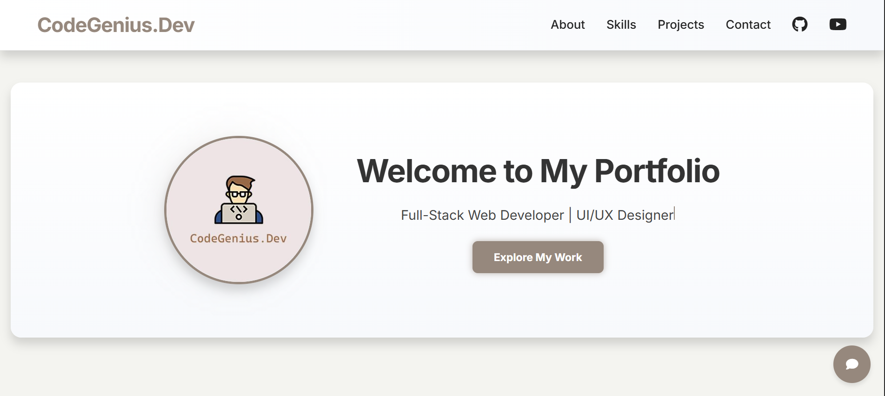

# GeniusX – Personal Portfolio + AI Agent by CodeGenius.Dev

**GeniusX** is a sleek, professional web app crafted by [CodeGenius.Dev](https://github.com/CodeGeniusDev). It showcases Abdullah Abbad’s full-stack development skills, top projects, and includes an AI-powered assistant to help users explore content and get coding help.

🔗 Live Site: [https://geniusx.netlify.app](https://geniusx.netlify.app)

---

## ✨ Features

- 🧑‍💻 **Developer Profile**: Learn about Abdullah Abbad, a skilled full-stack web developer and UI/UX designer.
- 📁 **Project Showcase**: Explore hand-picked, real-world projects with live previews.
- 🧠 **AI Assistant**: Engage with an intelligent chatbot agent that can guide users, answer technical questions, and explain project features.
- 💡 **Modern UI/UX**: Built with a clean, responsive design using modern CSS and frontend techniques.
- 🔐 **Fully Responsive**: Mobile-friendly layout with smooth navigation across devices.

---

## 🛠 Tech Stack

- **Frontend**: React.js, CSS3
- **AI Integration**: Custom chatbot using OpenAI API (or similar)
- **Deployment**: Netlify
- **Design**: Figma (UI planning), Custom CSS

---

## 📸 Screenshots

---

## 📄 License

This project is licensed under the MIT License – feel free to use and build upon it with credit.

---

## 🙋‍♂️ About the Creator

**Abdullah Abbad**  
📧 Email: codegenius.inc@gmail.com  
🌐 Portfolio: [https://portfolio.triplealpha.blog](https://portfolio.triplealpha.blog)  
🔗 LinkedIn: [linkedin.com/in/abdullah-abbad](https://www.linkedin.com/in/abdullah-abbad)  
💼 GitHub: [https://github.com/CodeGeniusDev](https://github.com/CodeGeniusDev)

---

## 🤝 Contributing

Want to contribute? Feel free to fork the repo, make enhancements, and submit a pull request!

---

## 📬 Contact

For project collaborations or custom development services, get in touch at `codegenius.inc@gmail.com` or WhatsApp +92 329 1540015.

